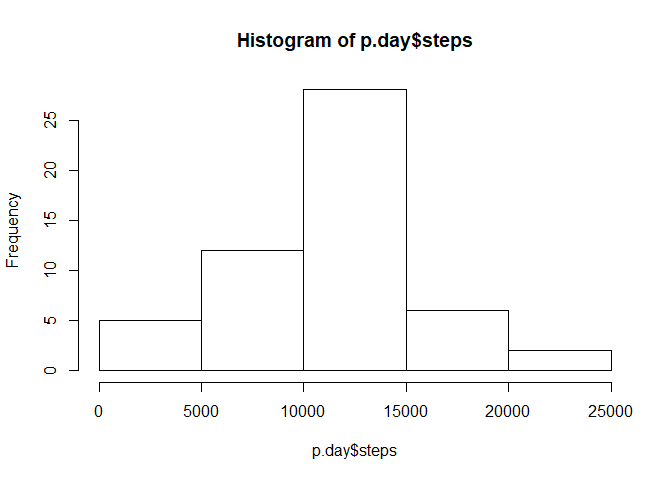
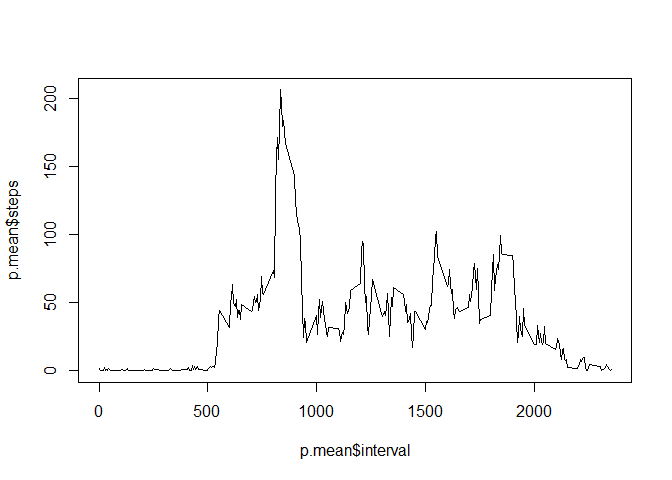
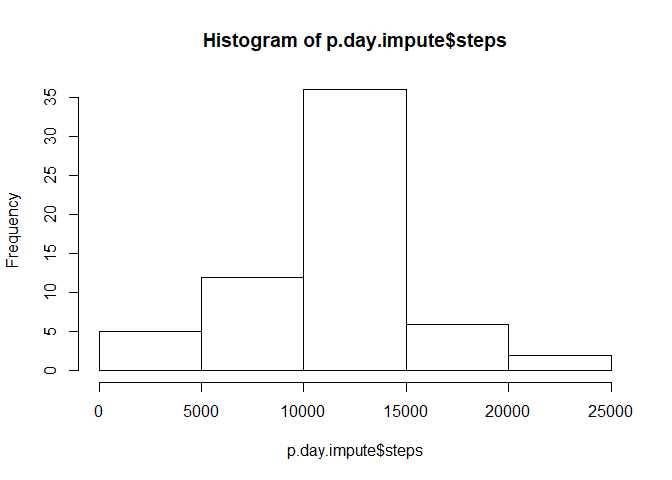
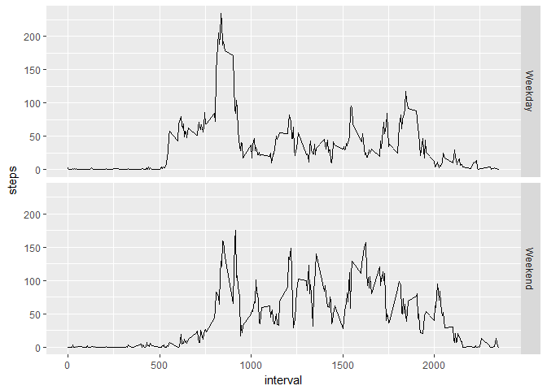

Loading and preprocessing the data
----------------------------------

### Load library

    library(ggplot2)

### 1. Load the data

    p <- read.csv(file = "dataset/activity.csv")
    str(p)

    ## 'data.frame':    17568 obs. of  3 variables:
    ##  $ steps   : int  NA NA NA NA NA NA NA NA NA NA ...
    ##  $ date    : Factor w/ 61 levels "2012-10-01","2012-10-02",..: 1 1 1 1 1 1 1 1 1 1 ...
    ##  $ interval: int  0 5 10 15 20 25 30 35 40 45 ...

### 2. Process/transform the data (if necessary) into a format suitable for your analysis

Variable *date* need to be converted to the correct type.

    p$date <- as.Date(p$date)
    str(p)

    ## 'data.frame':    17568 obs. of  3 variables:
    ##  $ steps   : int  NA NA NA NA NA NA NA NA NA NA ...
    ##  $ date    : Date, format: "2012-10-01" "2012-10-01" ...
    ##  $ interval: int  0 5 10 15 20 25 30 35 40 45 ...

What is mean total number of steps taken per day?
-------------------------------------------------

### 1. Calculate the total number of steps taken per day

    p.day <- aggregate(steps ~ date, p, FUN = sum, na.rm = TRUE)

### 2. Make a histogram of the total number of steps taken each day

    hist(p.day$steps, breaks = 5)

### 3. Calculate and report the mean and median of the total number of steps taken per day

    summary(p.day)

    ##       date                steps      
    ##  Min.   :2012-10-02   Min.   :   41  
    ##  1st Qu.:2012-10-16   1st Qu.: 8841  
    ##  Median :2012-10-29   Median :10765  
    ##  Mean   :2012-10-30   Mean   :10766  
    ##  3rd Qu.:2012-11-16   3rd Qu.:13294  
    ##  Max.   :2012-11-29   Max.   :21194

What is the average daily activity pattern?
-------------------------------------------

### 1. Make a time series plot (i.e. type = "l") of the 5-minute interval (x-axis) and the average number of steps taken, averaged across all days (y-axis)

    p.mean <- aggregate(steps ~ interval, p, FUN = mean, na.rm = TRUE)
    plot(p.mean$interval, p.mean$steps, type = "l")

### 2. Which 5-minute interval, on average across all the days in the dataset, contains the maximum number of steps?

    p.mean[which.max(p.mean$steps),]

    ##     interval    steps
    ## 104      835 206.1698

Imputing missing values
-----------------------

### 1. Calculate and report the total number of missing values in the dataset (i.e. the total number of rows with NAs)

    summary(p)

    ##      steps             date               interval     
    ##  Min.   :  0.00   Min.   :2012-10-01   Min.   :   0.0  
    ##  1st Qu.:  0.00   1st Qu.:2012-10-16   1st Qu.: 588.8  
    ##  Median :  0.00   Median :2012-10-31   Median :1177.5  
    ##  Mean   : 37.38   Mean   :2012-10-31   Mean   :1177.5  
    ##  3rd Qu.: 12.00   3rd Qu.:2012-11-15   3rd Qu.:1766.2  
    ##  Max.   :806.00   Max.   :2012-11-30   Max.   :2355.0  
    ##  NA's   :2304

### 2. Devise a strategy for filling in all of the missing values in the dataset. The strategy does not need to be sophisticated. For example, you could use the mean/median for that day, or the mean for that 5-minute interval, etc.

Use the mean for that 5-minute interval, since it was calculated in a
previous question.

### 3. Create a new dataset that is equal to the original dataset but with the missing data filled in.

    p.impute <- p
    for (i in 1:length(p.impute$steps)){
            if (is.na(p.impute$steps[i] == TRUE)){        
            p.impute$steps[i] <- p.mean$steps[p.impute$interval[i] == p.mean$interval]  
            } 
    }
    summary(p.impute)

    ##      steps             date               interval     
    ##  Min.   :  0.00   Min.   :2012-10-01   Min.   :   0.0  
    ##  1st Qu.:  0.00   1st Qu.:2012-10-16   1st Qu.: 588.8  
    ##  Median :  0.00   Median :2012-10-31   Median :1177.5  
    ##  Mean   : 37.38   Mean   :2012-10-31   Mean   :1177.5  
    ##  3rd Qu.: 27.00   3rd Qu.:2012-11-15   3rd Qu.:1766.2  
    ##  Max.   :806.00   Max.   :2012-11-30   Max.   :2355.0

### 4. Make a histogram of the total number of steps taken each day and Calculate and report the mean and median total number of steps taken per day. Do these values differ from the estimates from the first part of the assignment? What is the impact of imputing missing data on the estimates of the total daily number of steps?

    p.day.impute <- aggregate(steps ~ date, p.impute, FUN = sum, na.rm = TRUE)
    hist(p.day.impute$steps, breaks = 5)

    summary(p.day)

    ##       date                steps      
    ##  Min.   :2012-10-02   Min.   :   41  
    ##  1st Qu.:2012-10-16   1st Qu.: 8841  
    ##  Median :2012-10-29   Median :10765  
    ##  Mean   :2012-10-30   Mean   :10766  
    ##  3rd Qu.:2012-11-16   3rd Qu.:13294  
    ##  Max.   :2012-11-29   Max.   :21194

    summary(p.day.impute)

    ##       date                steps      
    ##  Min.   :2012-10-01   Min.   :   41  
    ##  1st Qu.:2012-10-16   1st Qu.: 9819  
    ##  Median :2012-10-31   Median :10766  
    ##  Mean   :2012-10-31   Mean   :10766  
    ##  3rd Qu.:2012-11-15   3rd Qu.:12811  
    ##  Max.   :2012-11-30   Max.   :21194

Are there differences in activity patterns between weekdays and weekends?
-------------------------------------------------------------------------

### Create a new factor variable in the dataset with two levels - "weekday" and "weekend" indicating whether a given date is a weekday or weekend day.

    p$week <- "NA"
    p[weekdays(p$date) == "Saturday" | weekdays(p$date) == "Sunday",]$week <- "Weekend"
    p[p$week == "NA",]$week <- "Weekday"
    p$week <- as.factor(p$week)
    str(p)

    ## 'data.frame':    17568 obs. of  4 variables:
    ##  $ steps   : int  NA NA NA NA NA NA NA NA NA NA ...
    ##  $ date    : Date, format: "2012-10-01" "2012-10-01" ...
    ##  $ interval: int  0 5 10 15 20 25 30 35 40 45 ...
    ##  $ week    : Factor w/ 2 levels "Weekday","Weekend": 1 1 1 1 1 1 1 1 1 1 ...

### Make a panel plot containing a time series plot (i.e. type = "l") of the 5-minute interval (x-axis) and the average number of steps taken, averaged across all weekday days or weekend days (y-axis). See the README file in the GitHub repository to see an example of what this plot should look like using simulated data.

    p.fweek <- aggregate(steps ~ interval + week, p, FUN = mean, na.rm = TRUE)
    plotweek <- ggplot(p.fweek)+geom_line(aes(x=interval, y=steps)) + facet_grid(week~.)
    print(plotweek)

